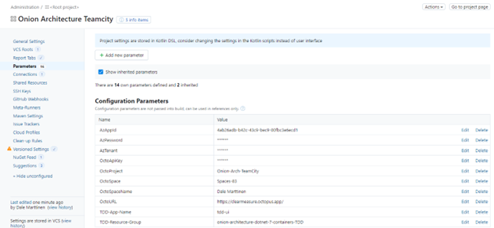
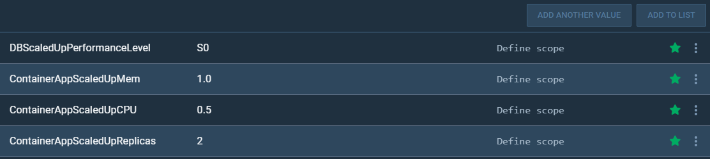
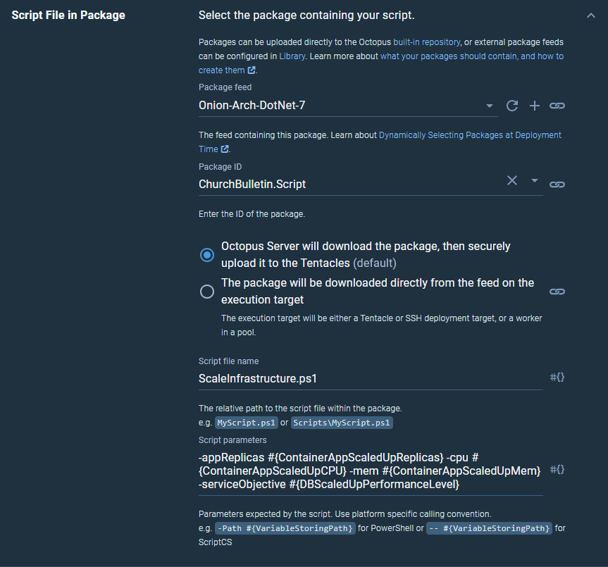

# Introduction 
TODO: Give a short introduction of your project. Let this section explain the objectives or the motivation behind this project. 

This project will create all of the required infrastructure in Azure programatically. The resoureces in the TDD environment will be torn down after automated testing is completed. The UAT and Prod resources will remain. There is an Octopus variable **EnsureEnvironmentsExist** that will tell Octopus to create all of the resources. If the variable is set to **True** Octopus will create all of the resources, if the variable is set to something else, Octopus will not create the resources. **EnsureEnvironmentsExist** should always be set to **True** for the TDD environment. This variable should be set to **False** (or anything other than **True**) for UAT and Prod to save time and preserve the existing resources during subsequent deployments.

# Onion Architecture .NET 7 Container Apps Getting Started
- [Github](#github)
- [Azure](#azure)
  - [Create an Azure Container Registry](#create-an-azure-container-registry)
  - [Connect Azure to Octopus Deploy](#connect-azure-to-octopus-deploy)
- [Octopus Deploy Environment Setup:](#octopus-deploy-environment-setup)
- [Octopus Deploy Project Setup:](#octopus-deploy-project-setup)
  - [Connect Octopus to GitHub](#connect-octopus-to-github)
  - [Create a new Version Controlled Project:](#create-a-new-version-controlled-project)
  - [Create and Update Project Variables](#create-and-update-project-variables)
  - [Optional-Create a runbook for availability monitoring](#optional-create-a-runbook-for-availability-monitoring)
- [Azure DevOps Setup:](#azure-devops-setup)
  - [Create Service Connections](#create-service-connections)
  - [Create an artifact feed](#create-an-artifact-feed)
  - [Authorize the Pipeline to push packages to the feed](#authorize-the-pipeline-to-push-packages-to-the-feed)
  - [Add the Azure DevOps Feed to Octopus](#add-the-azure-devops-feed-to-octopus)
  - [Create the Library Variable Group](#create-the-library-variable-group)
  - [Grant the pipeline access to the variable group](#grant-the-pipeline-access-to-the-variable-group)
  - [Create a Pipeline](#create-a-pipeline)
- [Github Actions Setup:](#github-actions-setup)
  - [Create Repository Secrets and Variables](#create-repository-secrets-and-variables)
    - [Create Github Packages API key](#create-github-packages-api-key)
    - [Create an Azure Service Principal](#create-an-azure-service-principal)
    - [Create an API Key in Octopus Deploy](#create-an-api-key-in-octopus-deploy)
    - [Create the following secrets:](#create-the-following-secrets)
    - [Create the following variables:](#create-the-following-variables)
  - [Connect Octopus to the Github Packages feed:](#connect-octopus-to-the-github-packages-feed)
- [TeamCity Setup](#teamcity-setup)
  - [Create a New Project](#create-a-new-project)
  - [Enable UI Updates](#enable-ui-updates)
  - [Create an Azure Service Principal](#create-an-azure-service-principal-1)
  - [Update Project Parameters](#update-project-parameters)
  - [Connect TeamCity to ACR](#connect-teamcity-to-acr)
  - [Create a TeamCity Nuget Feed](#create-a-teamcity-nuget-feed)
  - [Connect Octopus to the TeamCity feed](#connect-octopus-to-the-teamcity-feed)
    - [In Octopus Deploy](#in-octopus-deploy-1)
- [Octopus Deploy Runbook Setup:](#octopus-deploy-runbook-setup)
  - [Create ContainerAppReplicas variable](#create-containerappreplicas-variable)
  - [Create Scale Up Runbook](#create-scale-up-runbook)
  - [Create Scale Down Runbook](#create-scale-down-runbook)
  - [Publish the runbooks](#publish-the-runbooks)
  - [Create Scheduled Runbook Triggers](#create-scheduled-runbook-triggers)

Requirements:

- Octopus Deploy
- Azure
- Github

Optional:
- Azure DevOps
- TeamCity

This project is configured to work with either Azure DevOps Pipelines or Github Actions, or TeamCity.
Follow the [Github](#github),[Azure](#azure),[Octopus Deploy Environment Setup:](#octopus-deploy-environment-setup) and [Octopus Deploy Project Setup:](#octopus-deploy-project-setup) steps at the beginning of this document, then:
- If using Azure DevOps, follow the steps in the [Azure DevOps Setup:](#azure-devops-setup) section
- If using Github Actions, follow the steps in the [Github Actions Setup:](#github-actions-setup) section
- If using TeamCity, follow the steps in the [TeamCity Setup](#teamcity-setup) section
 
# Github
Fork the [onion-architecture-dotnet-7-container-apps](https://github.com/ClearMeasureLabs/onion-architecture-dotnet-7-container-apps) repo
# Azure

## Create an Azure Container Registry

[https://learn.microsoft.com/en-us/azure/container-registry/container-registry-get-started-portal?tabs=azure-cli](https://learn.microsoft.com/en-us/azure/container-registry/container-registry-get-started-portal?tabs=azure-cli)

Name the resource group something identifiable and different than the application environments. 
e.g. onion-architecture-container-apps-acr
The resource groups for the application environments will be created and destroyed programatically, the container registry should be kept separate.

When creating the container registry, a Basic SKU is sufficient. Name the container registry something identifiable. e.g. onion-architecture-container-apps

## Connect Azure to Octopus Deploy

### Create an Azure App Registration for Octopus Deploy

- In Azure AD select App Registrations

- Select New Registration
    1. Name the Registration something identifiable. e.g. Onion-Containers-Octo
    2. A Redirect URI is not needed
    3. Select Register

### Create a Client Secret

- Select Certificates and Secrets
- New Client Secret
- Provide a description and select add

- Save the client secret Value. It will be used in Octopus.

### Set Octopus Deploy as an Azure Contributor

- In your Azure subscription, navigate to Access Control (IAM), and add a role assignment
- Select Privileged administrator roles, then Contributor

- In the Members tab use the + Select Members page to select the App Registration that was created
- Press Review + assign

- Press Review + assign again to save

### Create an Azure Account in Octopus Deploy

- In Octopus Deploy navigate to Infrastructure -\> Accounts
- Add an Azure Subscription Account
    1. Name the account Azure-Onion-Containers
    2. Fill in the Subscription ID
        - This can be found in the Subscription Overview page in the Azure web portal
    3. Leave the Authentication Method as 'Use a Service Principal'
    4. Fill in the Tenant ID
        - This can be found in the Overview page of the App Registration in the Azure web portal
    5. Fill in the Application ID
        - This is the Application (client) ID from the App registration that was just created. This can be found in the Overview page in the Azure web portal
    6. Fill in the Application Password / Key
        - This is the client secret value that was created previously

# Octopus Deploy Environment Setup:

In Octopus Deploy create 3 environments.

- TDD
- UAT
- Prod

No Deployment targets need to be created.

Create a Lifecycle that uses those three environments promoting from TDD -\> UAT -\> Prod

# Octopus Deploy Project Setup:

## Connect Octopus to GitHub

### In GitHub

Create a Personal Access Token with repo access only.
Save the token for use in Octopus

### In Octopus

Create Git Credentials using the GitHub Personal Access Token

## Create a new Version Controlled Project:

1. Create a new project, ensure the "Use version control for this project" box is checked
2. Use the Lifecycle that was just created

3. Click Save AND CONFIGURE VCS

      1. Skip the "How do you intend to use this project" popup
4. Set the Git Repository URL to the URL of the forked repo
5. Use the Library Git Credentials that were created earlier

7. Click CONFIGURE and push the initial commit to convert the project

## Create and Update Project Variables

In the Octopus Project navigate to Variables -\> Project

- Create a variable named **DatabasePassword** Set the values to Sensitive and enter passwords for TDD, UAT, and Prod environments
- Update **registry\_login\_server** to the login server of the Azure Container Registry that was created
  - This login server can be found in the Overview page of the container registry in the Azure Web Portal
- Update **EnsureEnvironmentsExist** to True for Prod/UAT to ensure that all resources will be created the first time.

## Optional-Create a runbook for availability monitoring

In the deployment process Octopus will setup Azure App Insights to monitor the availability of the app. If the healthcheck endpoint returns unhealthy an alert will be created that triggers an Octopus Runbook. 
To configure the Runbook integration:
- There is a variable in the project named **OctoRunbookName** this is the name of the Runbook that Azure will run. Create a Runbook with the same name. e.g. Unhealthy app alert
- In the project create a variable named **azrunbookAPI** Set the value to Sensitive and provide an API key that has access to the project
- Update **OctoInstanceURL** with the URL of your Octopus instance

# Azure DevOps Setup:

Create a new project

Install the Octopus Deploy Integration ([https://marketplace.visualstudio.com/items?itemName=octopusdeploy.octopus-deploy-build-release-tasks](https://marketplace.visualstudio.com/items?itemName=octopusdeploy.octopus-deploy-build-release-tasks))

## Create Service Connections

To create a service connection
  - Go to Project Settings in the bottom left
  - Under the Pipelines heading, select Service Connections
  - Select Create Service Connection

### Create an Azure Resource Manager Service Connection
  - Select Azure Resource Manager as the new service connection type

  - Use the recommended authentication method (Service Principal (automatic))
  - Select your Azure Subscriptoin
  - Leave the Resource Group section blank
  - Name the Service Connection: dotnet-7-containerapp
  - Check 'Grant access permission to all pipelines'

  - Save the service connection

### Create an Octopus Deploy Service connection

  - In Octopus Deploy create an API key ([https://octopus.com/docs/octopus-rest-api/how-to-create-an-api-key](https://octopus.com/docs/octopus-rest-api/how-to-create-an-api-key))
  - In Azure DevOps select New Service Connection, choose Octopus Deploy as the type

  - Fill in the URL of your Octopus instance, the API key that was created, and name the service connection: OctoServiceConnection
  - Check 'Grant access permission to all pipelines'

  - Save the service connection

### Create an Azure Container Registry Service Connection

  - Select New Service Connection, choose Docker Registry as the type

  - Configure the registry
    1. Choose Azure Container Registy as the type
    2. Choose Service Principal as the Authentication Type
    3. Select your Azure Subscription
    4. Select the container registry that was created
    5. Name the service connection: OnionArchACRServiceConnection
    6. Select 'Grant access permission to all pipelines'

- Save the Service Connection

## Create an artifact feed

- In the Azure DevOps project: Go to Artifacts, then select **+ Create Feed**

- Name the feed something relevant, scope it to the current project, select create

## Authorize the Pipeline to push packages to the feed

- Set the Project Build Service identity to be a  **Contributor**  on your feed ([https://learn.microsoft.com/en-us/azure/devops/artifacts/feeds/feed-permissions?view=azure-devops#configure-feed-settings](https://learn.microsoft.com/en-us/azure/devops/artifacts/feeds/feed-permissions?view=azure-devops%23configure-feed-settings))

## Add the Azure DevOps Feed to Octopus

### Create a Personal Access Token

1. Create an Azure DevOps Personal Access Token [https://learn.microsoft.com/en-us/azure/devops/organizations/accounts/use-personal-access-tokens-to-authenticate?view=azure-devops&tabs=Windows](https://learn.microsoft.com/en-us/azure/devops/organizations/accounts/use-personal-access-tokens-to-authenticate?view=azure-devops&tabs=Windows)
2. Give the token the Packaging Read scope
3. Save the token for use in Octopus

### In Azure DevOps

1. Navigate to the Artifacts page.
2. Select the 'Connect to Feed' button
3. Select Nuget.exe as the feed type
4. In the Project Setup section, copy the URL from the value field

### In Octopus Deploy

1. Navigate to Library -\> External Feeds and select ADD FEED
2. Set the Feed type to NuGet Feed
3. Name the feed Onion-Arch-DotNet-7
4. Paste in the URL that was copied from Azure DevOps
5. Provide something in the Feed username field. It can be anything other than an empty string. It's not actually used.
6. Provide the personal access token from Azure DevOps as the Feed Password

## Create the Library Variable Group

1. In the Azure DevOps project: Go to Pipelines -\> Library

2. Create a variable group named **Integration-Build**

    1. Create a variable called **FeedName**. The value will be \<Azure DevOps project name\>/\<Azure DevOps feed name\>
    2. Create a variable called **OctoProjectGroup** with the value being the Project Group that houses your Octopus Project.
    3. Create a variable called **OctoProjectName** with the value being the name of your Octopus Project.
    4. Create a variable called **OctoSpace** with the value being the name of your Octopus Space.
    5. Create a variable called **TDDAppName** with the value equaling the Octopus **container_app_name** variable TDD value. default is tdd-ui
    6. Create a variable called **TDDResourceGroup** with the value equaling the Octopus **ResourceGroupName** variable TDD value. default is onion-architecture-dotnet-7-containers-tdd

3. Save the variable group

## Grant the pipeline access to the variable group

1. From the variable group page select the Pipeline permissions tab at the top
2. Select the hamburger menu, and select Open Access

3. Select Open access to allow all pipelines in the project to use the variable group

## Create Environments

1. Go to Pipelines -\> Environments
2. Select New environment
3. Create three environments.
- TDD
- UAT
- Prod
4. In the UAT and Prod environments, add an approval check and select the users that need to approve the appropriate deploy stages.

## Create a Pipeline

1. Go to Pipelines -\> Pipelines

1. Select Create Pipeline
2. Select Github as the location for your code
3. Accept and allow Github and Azure DevOps to connect

4. Select the forked repo when asked to select a repository
5. Select Approve & Install to allow Azure Pipelines to connect to GitHub
6. When reviewing the pipeline YAML select **Run** to create and run the Pipeline for the first time

The pipeline will build the application, create all of the resources in the TDD environment, deploy the app to TDD, test the app, then destroy the TDD resources. Then the Azure resources in UAT will be created, and the app will be deployed to TDD. Ultimately Prod resources will be created, and the app will be deployed to Prod

# Github Actions Setup:

## Create Repository Secrets and Variables

- In the GitHub UI, navigate to your forked repository settings and select Security > Secrets and variables > Actions.
- Select New repository secret to add secrets, or select the Variables tab, and New repository variable to add variables.

### Create Github Packages API key
- Create a classic Github Personal Access Token that has **write:Packages** scope. Save the token for a repository secret, and for Octopus Deploy. ([https://docs.github.com/en/enterprise-server@3.4/authentication/keeping-your-account-and-data-secure/creating-a-personal-access-token](https://docs.github.com/en/enterprise-server@3.4/authentication/keeping-your-account-and-data-secure/creating-a-personal-access-token))

### Create an Azure Service Principal
Using the az cli run:
- az ad sp create-for-rbac --scope /subscriptions/subscriptionid --role AcrPush --sdk-auth
- replace **subscriptionid** with the id of your Azure subscription. Save the JSON output as it will be needed later.

### Create an API Key in Octopus Deploy
In Octopus Deploy create an API key. Save the value for a repository secret. 
([https://octopus.com/docs/octopus-rest-api/how-to-create-an-api-key](https://octopus.com/docs/octopus-rest-api/how-to-create-an-api-key))
  
### Create the following secrets:

Secret: Value
1. AZURE_CREDENTIALS:	    The entire JSON output from the service principal creation step
2. REGISTRY_LOGIN_SERVER:	The login server name of your registry (all lowercase). Example: myregistry.azurecr.io
3. REGISTRY_USERNAME:	    The clientId from the JSON output from the service principal creation
4. REGISTRY_PASSWORD:	    The clientSecret from the JSON output from the service principal creation  
5. PACKAGESAPI:           The Personal Access Token that was just created
6. OCTOPUS_URL:           The URL of your Octopus Deploy instance. e.g. https://clearmeasure.octopus.app/
7. OCTO_API_KEY:          The value of the Octopus Deploy API key
  
### Create the following variables:

Variable: Value
1. OCTOPUS_PROJECT:       The name of your Octopus Deploy project
2. OCTOPUS_SPACE:         The name of your Octopus Deploy space
3. USERNAME:              The github username of the user that created the PAT
4. OWNER:                 The owner of the repository. 

## Connect Octopus to the Github Packages feed:
In Octopus Deploy:
- Navigate to Library -\> External Feeds and select ADD FEED
- Set the Feed type to NuGet Feed
- Name the feed Onion-Arch-DotNet-7
- Paste in the URL of the Github Packages feed
  1. The URL should be: https://nuget.pkg.github.com/owner/index.json
  2. Replace **owner** with the owner of the repo
- Set the Feed username to the github username of the user that created the PAT
- Provide the personal access token from Github as the Feed Password

## Create Environments
In Github
1. Go to Settings -\> Environments
2. Select New environment
3. Create three environments.
- TDD
- UAT
- Prod
4. In the UAT and Prod environments, check Required reviewers box and select the users that need to approve that stage

## Enable Github Actions Workflows
In the forked Github repository, navigate to Actions. Select *I understand my workflows, go ahead and enable them*

Push a commit to trigger Github Actions to run the pipeline.  

# TeamCity Setup

## Create a New Project
Create a New Project by selecting the **New project…** button in the top right

Select the git repository that was created as the repository to create from

Select **Import settings from .teamcity/settings.kts and enable synchronization with the VS repository**

Select **Proceed**

## Enable UI Updates

Navigate to Project settings -> Versioned settings
Check the box **Allow editing project settings via UI**

Select Apply

## Create an Azure Service Principal
Using the az cli run:
- az ad sp create-for-rbac --scope /subscriptions/subscriptionid --role Contributor --sdk-auth
- replace **subscriptionid** with the id of your Azure subscription. Save the JSON output as it will be needed later.

## Update Project Parameters
Navigate to Project Settings -> Parameters

Edit the following Configuration Parameters
- AzAppId – The clientId from the JSON output from the service principal creation
- AzPassword (password spec) - The clientSecret from the JSON output from the service principal creation
- AzTenant (password spec) – The tenantId from the JSON output from the service principal creation
-	OctoApiKey (password spec) – API key from Octopus Deploy
- OctoProject – Name of the Octopus Deploy project that was created
- OctoSpace – ID of the Octopus Deploy Space that houses the project. This should be Spaces-##
- OctoSpaceName – Name of the Octopus Deploy Space that houses the project. E.g. Default
- OctoURL – URL of the Octopus Deploy Instance. E.g. https://clearmeasure.octopus.app

## Connect TeamCity to ACR

-	Select Edit Project -> Connections
-	Edit the existing Onoin-Arch ACR connection
-	Set the registry address to the login server of the ACR that was created
-	Set the Username to the clientId from the JSON output from the service principal creation
-	Set the Password to the clientSecret from the JSON output from the service principal creation

## Create a TeamCity Nuget feed

Navigate to Edit Project -> NuGet Feed
- If this option is not available, contact TeamCity and request a NuGet feed be enabled
Name the feed Onion_Architecture_Container_Apps
In the Integration Build build configuration, edit the Publish Packages Build Step
- Set the API key value to: **%teamcity.nuget.feed.api.key%**
- Set the Package Source value to the nuget feed that was just created
- The nuget feed can be found in the hamburger dropdown menu

## Connect Octopus to the TeamCity feed:
### In Octopus Deploy
1.	Navigate to Library -> External Feeds and select ADD FEED
2.	Set the Feed type to NuGet Feed
3.	Name the feed Onion-Arch-DotNet-7
4.	Copy the v3 URL from the TeamCity Nuget feed into the URL field
5.	Provide the username from one of the TeamCity users as the Username. 
6.	Provide the password from the TeamCity user as the Feed Password
- Making a TeamCity user for Octopus to connect to TeamCity is recommended

Push a commit to the git repo, and the pipeline will start

# Octopus Deploy Runbook Setup:

In the ChurchBulletin.Scripts package that is created there is a script called ScaleInfrastructure.ps1. When provided with appReplicas and/or serviceObjective values the script will set the min and max number of replicas of the container app and the service objective of the database. This is used with Octopus Runbooks ([Runbooks Documentation](https://octopus.com/docs/runbooks#:~:text=To%20create%20or%20manage%20your,%E2%9E%9C%20Runbooks%20%E2%9E%9C%20Add%20Runbook.)) to scale up and down the infrastructure for day and nighttime loads.

## Create ContainerAppReplicas variable

In your Octopus Deploy project, create two new variables
- **ContainerAppScaledUpReplicas** and give it an integer value. e.g. 2
- **ContainerAppScaledUpCPU** and give it a float value. e.g. 0.5
- **ContainerAppScaledUpMem** and give it a float value. e.g. 1.0
- **DBScaledUpPerformanceLevel** and give it service objective value. e.g. S0

Commit these variables to main. **Variables not in the default branch will not be accessible to runbooks**

## Create Scale Up Runbook

- In your Octopus Deploy project, navigate to Operations -> Runbooks and select ADD RUNBOOK
- Name the runbook Scale Up Infrastructure
- Select Save

- Select DEFINE YOUR RUNBOOK PROCESS near the upper right

- And then select ADD STEP

- Use the run az Azure Script step template

- Select ADD

- Name the step **Scale Up Infrastructure**
- Leave Execution Location, Worker Pool, Container Image, and Azure Tools as default

- Under Azure -> Account select the chain links icon to bind the account value to a variable. Then set the value to **#{AzureAccount}** 

- Under Script Source select **Script file inside a package** 
- Under Script File in Package set the Package feed to the feed that was created.
- Set the Package ID to **ChurchBulletin.Script**
- Set the Script file name to **ScaleInfrastructure.ps1**
- Set the Script parameters to **-appReplicas #{ContainerAppScaledUpReplicas} -cpu #{ContainerAppScaledUpCPU} -mem #{ContainerAppScaledUpMem} -serviceObjective #{DBScaledUpPerformanceLevel}**

Leave the rest of the settings at default, and select SAVE

## Create Scale Down Runbook

Create another runbook named Scale Down Container App using the same directions.

- Change the Step Name to **Scale Down Infrastructure**
- Leave the Script Parameters blank

## Publish the runbooks

Runbooks must be published before they can be consumed by triggers.

- Navigate to the Scale Up Infrastructure runbook. Select PUBLISH

- Leave the default settings, and select PUBLISH

- Do the same for Scale Down Infrastructure

## Create Scheduled Runbook Triggers
([Runbook Triggers Documentation](https://octopus.com/docs/runbooks/scheduled-runbook-trigger))

- Navigate to Operations -> Triggers
- Select ADD SCHEDULED TRIGGER
- Name the trigger Scale Up Morning
- Under Runbook select Scale Up Infrastructure
- Under Target Environments select Prod
- Leave the schedule at Daily
- Under Run Days uncheck Saturday and Sunday
- Set Schedule Timezone to your timezone
- Leave the Interval at once
- Set the Start Time to 8:00 AM
- Click Save

- Create another trigger named Scale Down Evening
- Use the Scale Down Container App runbook
- Under Target Environments select Prod
- Under Run Days uncheck Saturday and Sunday
- Set Schedule Timezone to your timezone
- Set the Start Time to 6:00 PM
- Click Save

Now the container app and database will automatically be scaled up every morning, and scaled down every evening

# Build and Test
TODO: Describe and show how to build your code and run the tests. 

# Contribute
TODO: Explain how other users and developers can contribute to make your code better. 

If you want to learn more about creating good readme files then refer the following [guidelines](https://docs.microsoft.com/en-us/azure/devops/repos/git/create-a-readme?view=azure-devops). You can also seek inspiration from the below readme files:
- [ASP.NET Core](https://github.com/aspnet/Home)
- [Visual Studio Code](https://github.com/Microsoft/vscode)
- [Chakra Core](https://github.com/Microsoft/ChakraCore)
